# **Quarkus Native Demo: High-Velocity Bid Receiver**

## **1\. Business Case**

In Real-Time Bidding (RTB), latency equals lost revenue. When traffic spikes, we need to spin up new instances instantly.

* **Traditional Java (JVM):** Takes 5-15 seconds to start and "warm up" (JIT compilation). We miss thousands of bid requests during this window.
* **Quarkus Native:** Starts in \<50ms, fully ready to handle peak load. Zero missed revenue during scale-out events.

## **2\. The Scenario**

This service acts as the "Frontline Receiver" for RTB requests.

1. Receives a high-volume stream of POST /bid-request (JSON payloads).
2. Performs fast validation (is the payload malformed? is the device blocked?).
3. Pushes valid requests to a Kafka topic for the complex Decision Engine to process.

## **3\. Real-World Data Sample (OpenRTB Simplified)**

We will perform load testing using realistic, albeit simplified, OpenRTB JSON payloads.

```json
{
  "id": "80ce30c53c16e6ede735f123ef6e32361bfc7b22",
  "at": 1,
  "cur": ["USD"],
  "imp": [
    {
      "id": "1",
      "banner": { "w": 300, "h": 250, "pos": 1 }
    }
  ],
  "site": {
    "id": "102855",
    "domain": "espn.com",
    "cat": ["IAB17"]
  },
  "device": {
    "ua": "Mozilla/5.0 (iPhone; CPU iPhone OS 14_0 like Mac OS X)...",
    "ip": "123.145.167.10",
    "os": "iOS",
    "devicetype": 1
  },
  "user": {
    "id": "55816b39711f9b5acf3b90e313ed29e51665623f"
  }
}
```

[//]: # (## **4\. The "Spike Test" Comparison**)


## **4\. Architecture Overview**

### System Design

```mermaid
graph TB
    subgraph "Load Balancer / Ingress"
        LB[Load Balancer<br/>Port 8070-8073]
    end
    
    subgraph "Receiver Layer - High Throughput HTTP Services"
        QR[Quarkus Receiver JVM<br/>:8070<br/>~16.7K RPS]
        QRN[Quarkus Receiver Native<br/>:8071<br/>~16.8K RPS]
        GR[Go Receiver<br/>:8072<br/>~17.6K RPS]
        RR[Rust Receiver<br/>:8073<br/>~21.8K RPS]
    end
    
    subgraph "Message Queue"
        K[Apache Kafka<br/>Topic: bids<br/>3 partitions]
    end
    
    subgraph "Stream Processing"
        QS[Quarkus Sinker<br/>:8074<br/>Kafka Streams]
    end
    
    subgraph "Data Storage"
        PG[(PostgreSQL<br/>Database)]
    end
    
    subgraph "Observability Stack"
        P[Prometheus<br/>:9090<br/>Metrics]
        G[Grafana<br/>:3000<br/>Dashboards]
        J[Jaeger<br/>:16686<br/>Distributed Tracing]
    end
    
    subgraph "Management Tools"
        KD[Kafdrop<br/>:9000<br/>Kafka UI]
    end
    
    LB --> QR
    LB --> QRN
    LB --> GR
    LB --> RR
    
    QR -->|Reactive Messaging| K
    QRN -->|Reactive Messaging| K
    GR -->|Kafka Producer| K
    RR -->|Kafka Producer| K
    
    K --> QS
    QS -->|Persist| PG
    
    QR -.->|Metrics| P
    QRN -.->|Metrics| P
    GR -.->|Metrics| P
    RR -.->|Metrics| P
    QS -.->|Metrics| P
    
    QR -.->|Traces| J
    QRN -.->|Traces| J
    QS -.->|Traces| J
    
    P --> G
    K -.->|Monitor| KD
    
    style QR fill:#4695eb
    style QRN fill:#4695eb
    style GR fill:#00ADD8
    style RR fill:#f74c00
    style K fill:#231F20
    style QS fill:#4695eb
    style PG fill:#336791
    style P fill:#e6522c
    style G fill:#f46800
    style J fill:#60d0e4
    style KD fill:#0c0c0c
```



### Service Comparison

| Service | Port | Technology | Image Size | Use Case |
|---------|------|------------|------------|----------|
| **quarkus-receiver** | 8070 | Quarkus JVM + Alpine JRE | 387MB | Production-ready JVM with fast startup |
| **quarkus-receiver-native** | 8071 | Quarkus Native (GraalVM) | 271MB | Instant startup, minimal memory |
| **go-receiver** | 8072 | Go + Gin | 51.6MB | Minimal footprint, high throughput |
| **rust-receiver** | 8073 | Rust + Actix | 132MB | Maximum performance, memory safety |
| **quarkus-sinker** | 8074 | Quarkus JVM + Kafka Streams | 582MB | Consumer that sinks to PostgreSQL |

**All services are built using multi-stage Dockerfiles** - no pre-build steps required!

## **5\. Quick Start**

### Prerequisites
- Docker & Docker Compose
- 4GB+ RAM recommended

### Build & Run All Services
```bash
# Build all images (includes Maven/Go/Rust compilation inside Docker)
docker-compose build

# Start the entire stack (Kafka, PostgreSQL, receivers, monitoring)
docker-compose up

# Or run specific services
docker-compose up quarkus-receiver kafka postgres
```

### Test the Endpoints
```bash
# Test Quarkus JVM receiver
curl -X POST http://localhost:8070/bid-request \
  -H "Content-Type: application/json" \
  -d '{"id":"test123","at":1,"imp":[{"id":"1"}]}'

# Test Go receiver
curl -X POST http://localhost:8072/bid-request \
  -H "Content-Type: application/json" \
  -d '{"id":"test123","at":1,"imp":[{"id":"1"}]}'
```

### Access Monitoring
- **Kafdrop** (Kafka UI): http://localhost:9000
- **Grafana**: http://localhost:3000
- **Prometheus**: http://localhost:9090

## **6\. Kubernetes Deployment**

This project includes a production-ready Helm chart for deploying to any Kubernetes cluster (local or cloud).

### Prerequisites
- Kubernetes cluster (kind, minikube, EKS, AKS, GKE)
- Helm 3.x
- kubectl configured

### Deploy with Helm

```bash
# Create namespace
kubectl create namespace adtech-demo

# Install the Helm chart
helm install quarkus-adtech-demo ./helm/quarkus-adtech-demo \
  --namespace adtech-demo

# Check deployment status
kubectl get pods -n adtech-demo

# Access services (using port-forward for local clusters)
kubectl port-forward -n adtech-demo svc/quarkus-receiver 8070:8070
kubectl port-forward -n adtech-demo svc/prometheus 9090:9090
kubectl port-forward -n adtech-demo svc/grafana 3000:3000
kubectl port-forward -n adtech-demo svc/jaeger 16686:16686
```

### Deploy with ArgoCD (GitOps)

```bash
# Install ArgoCD (if not already installed)
kubectl create namespace argocd
kubectl apply -n argocd -f https://raw.githubusercontent.com/argoproj/argo-cd/stable/manifests/install.yaml

# Create ArgoCD application
kubectl apply -f - <<EOF
apiVersion: argoproj.io/v1alpha1
kind: Application
metadata:
  name: quarkus-adtech-demo
  namespace: argocd
spec:
  project: default
  source:
    repoURL: https://github.com/dtkmn/quarkus-adtech-demo
    targetRevision: dev
    path: helm/quarkus-adtech-demo
  destination:
    server: https://kubernetes.default.svc
    namespace: adtech-demo
  syncPolicy:
    automated:
      prune: true
      selfHeal: true
    syncOptions:
      - CreateNamespace=true
EOF

# Access ArgoCD UI
kubectl port-forward -n argocd svc/argocd-server 8443:443
```

### Local Kubernetes with kind

```bash
# Create kind cluster with port mappings
kind create cluster --name adtech-demo --config kind-config.yaml

# Load local images into kind
kind load docker-image quarkus-receiver:latest --name adtech-demo
kind load docker-image quarkus-receiver-native:latest --name adtech-demo
kind load docker-image go-receiver:latest --name adtech-demo
kind load docker-image rust-receiver:latest --name adtech-demo
kind load docker-image quarkus-sinker:latest --name adtech-demo

# Deploy with Helm
helm install quarkus-adtech-demo ./helm/quarkus-adtech-demo \
  --namespace adtech-demo --create-namespace
```

### Kubernetes Observability

The Helm chart includes:
- **Prometheus**: Pod-level metrics collection with Kubernetes service discovery
- **Jaeger**: Distributed tracing for request flows (HTTP → Kafka → Database)
- **Health Checks**: Liveness and readiness probes for all services
- **Resource Limits**: CPU and memory limits configured for production

Access Jaeger UI:
```bash
kubectl port-forward -n adtech-demo svc/jaeger 16686:16686
# Open http://localhost:16686
```

### Cloud Deployment Notes

For deploying to cloud Kubernetes (EKS, AKS, GKE):

1. **Push images to a container registry**:
   ```bash
   docker tag quarkus-receiver:latest your-registry.io/quarkus-receiver:latest
   docker push your-registry.io/quarkus-receiver:latest
   ```

2. **Update `values.yaml`**:
   ```yaml
   serviceType: LoadBalancer  # or use Ingress
   applicationImagePullPolicy: IfNotPresent
   quarkusReceiver:
     image: your-registry.io/quarkus-receiver:latest
   ```

3. **Use managed services** (optional):
   - AWS MSK (Managed Kafka) instead of in-cluster Kafka
   - AWS RDS (PostgreSQL) instead of in-cluster database
   - AWS Managed Prometheus & Grafana

## **7\. Comprehensive Benchmark Comparison**

The following table compares our actual test results with performance for traditional stacks in a similar Docker Desktop environment (constrained to \~3-4 vCPUs).

Metric | Go (Gin) | Quarkus Native | Rust (Actix) | Spring Boot (JVM)* | Python (FastAPI)* |
| :---- | :---- | :---- | :---- | :---- | :---- |
| **Max Throughput** | **~31,000 RPS** | **~30,000 RPS** | **~31,000 RPS** | ~14,000 RPS | ~7,000 RPS |
| **Avg. Latency** | **1.57ms** | **1.70ms** | **1.55ms** | ~8.5ms | ~25ms |
| **Idle Memory** | **~15 MB** | **~35 MB** | **~12MB** | ~450 MB | ~120 MB |
| **Startup Time** | **Instant** | **0.05s** | **Instant** | 10s+ | 1s |
| **Bottleneck** | Network/Infra | Network/Infra | Network/Infra | CPU (JIT Warmup) | CPU (GIL) |


**Key Takeaways:**

1. **Go & Quarkus Native** are in a league of their own. They are so fast they saturate the Docker network (\~30k RPS) before their own code becomes the bottleneck.
2. **Spring Boot (Standard JVM)** is robust but heavy. It requires significantly more memory (\~10x) and takes seconds to start, making it less ideal for serverless or instant-scaling AdTech scenarios.
3. **Python (FastAPI)** is excellent for development speed but struggles with raw throughput in high-concurrency scenarios due to the Global Interpreter Lock (GIL) and interpreter overhead. To match Go's 30k RPS, you would likely need 4-5x more hardware.

## **8\. Load Testing**

Run k6 load tests against any receiver:

```bash
# Test Quarkus JVM receiver
k6 run --vus 100 --duration 30s k6/load-test.js

# Test different services by changing the BASE_URL
BASE_URL=http://localhost:8072 k6 run k6/load-test.js  # Go receiver
BASE_URL=http://localhost:8073 k6 run k6/load-test.js  # Rust receiver
```

## **9\. Docker Image Optimization**

All services use optimized, multi-stage Dockerfiles:

- **Build stage**: Compiles the application (Maven/Go/Rust)
- **Runtime stage**: Minimal Alpine-based images with only runtime dependencies
- **No pre-build required**: `docker-compose build` handles everything

### Image Size Comparison
- **Go receiver**: 51.6 MB (Alpine + compiled binary)
- **Rust receiver**: 132 MB (Debian Slim + compiled binary)
- **Quarkus Native**: 271 MB (UBI Minimal + native executable)
- **Quarkus JVM**: 387 MB (Alpine + Temurin JRE 21)
- **Quarkus Sinker**: 582 MB (Alpine + Temurin JRE 21 + larger dependencies)

## **10\. Development**

### Local Development (without Docker)

For Quarkus services:
```bash
cd services/quarkus-receiver
./mvnw quarkus:dev  # Hot reload enabled
```

For Go service:
```bash
cd services/go-receiver
go run cmd/receiver/main.go
```

For Rust service:
```bash
cd services/rust-receiver
cargo run
```

### Rebuild Individual Services
```bash
docker-compose build quarkus-receiver
docker-compose build go-receiver
```

## **11\. CI/CD**

GitHub Actions workflow automatically builds and pushes all service images to GitHub Container Registry on every push to `main`. No pre-build steps needed - the multi-stage Dockerfiles handle everything!

---

*Benchmark disclaimers: Results based on M-series Mac with Docker Desktop. Production results may vary.*
